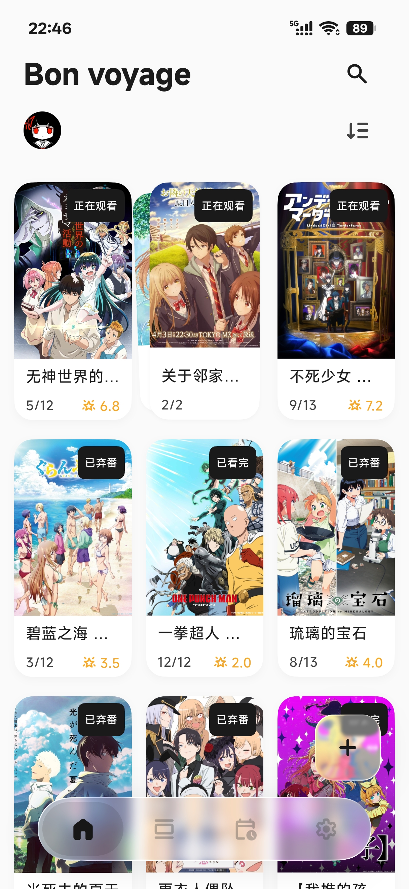
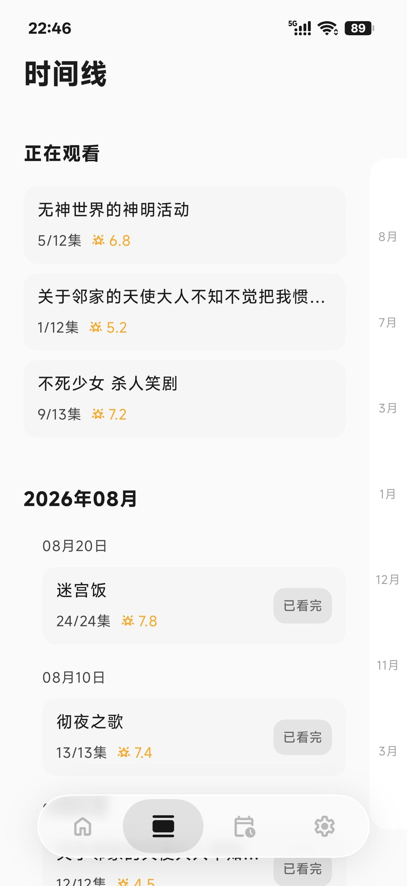
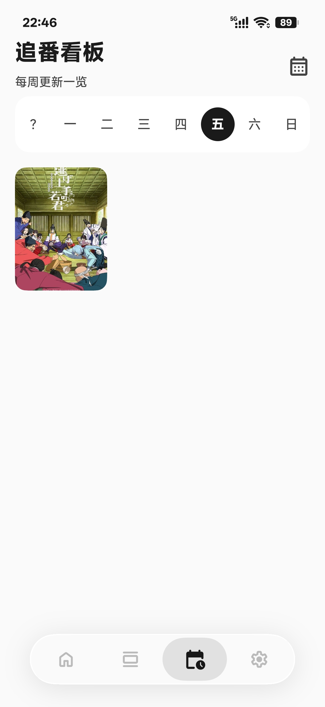
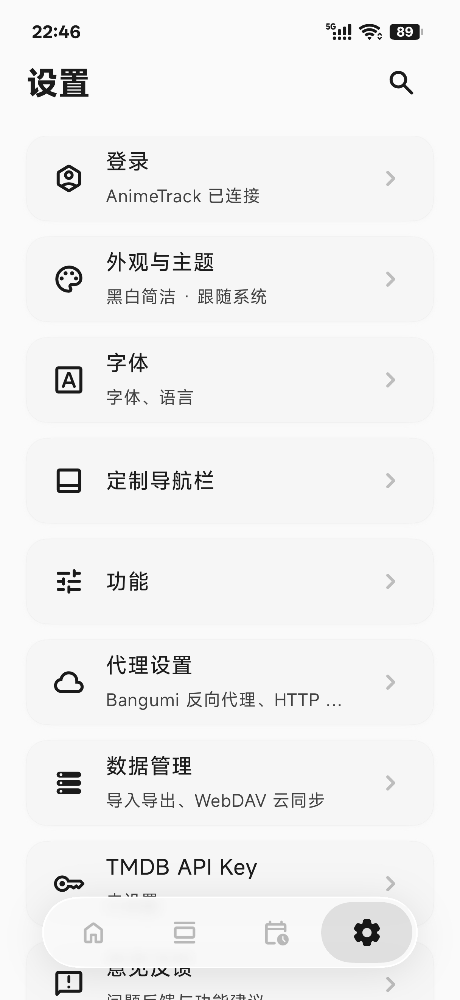
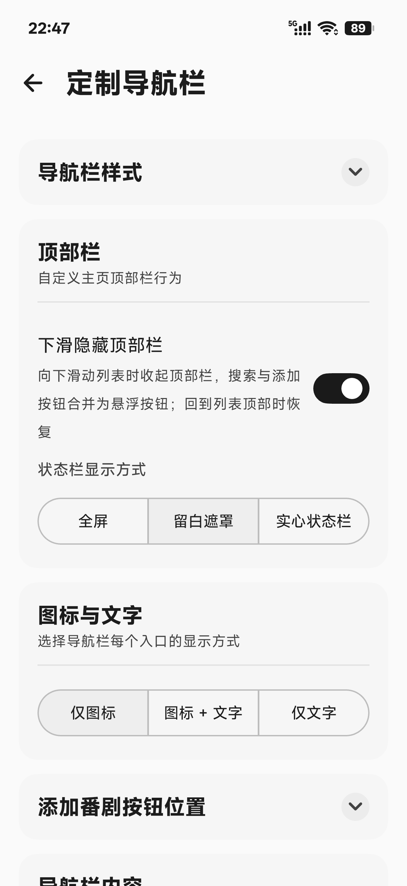
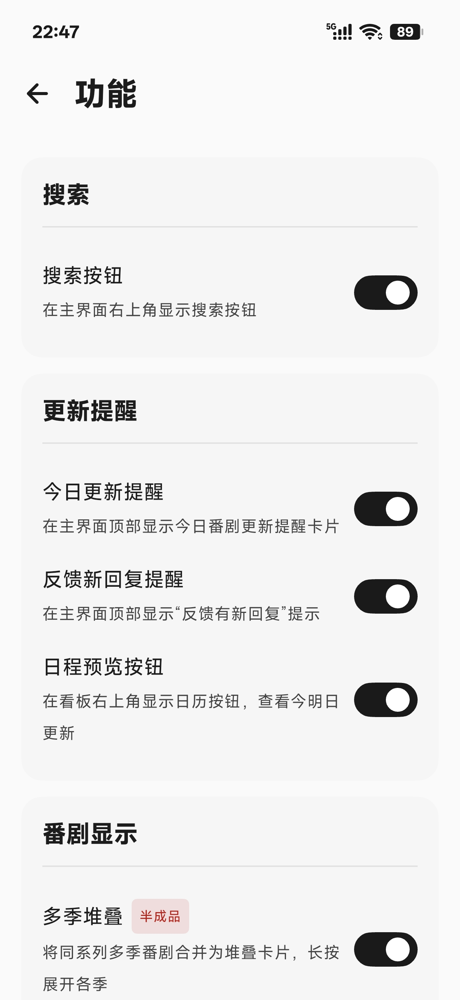
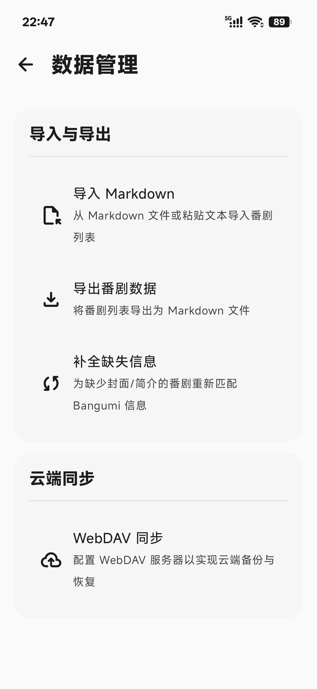

   
  <h1 align="center">AnimeTrack</h1>
  

    <i>An Android anime tracking tool following Material Design 3 — Remember what you've watched.</i>
  

  

    
  

  

    
    
    
    
  

  

    
    
  

AnimeTrack is an Android anime tracking tool designed around "what you've watched" and "when you watched it", offering a complete workflow from search, marking, playback, to review.

- **Multi-source search & marking** – Search for anime via Bangumi or TMDB, quickly mark as "Wish to Watch", "Watching", or "Watched", with automatic completion time recording.
- ~~**Built-in player & progress sync** – Integrates ExoPlayer, supports playing local resources from WebDAV, automatically updates episode count after finishing, no manual intervention needed.~~
- **Timeline & Board** – All watched records are aggregated into a timeline for easy review of your watch history; ongoing series are grouped by weekday on the board, so today's updates are clear at a glance.
- **Cross-device data sync** – Supports four sync methods: own account, Bangumi, Bilibili, and WebDAV. Cloud backup, device migration, and seamless cross-device transitions keep your data always with you.

---

<h2 align="center">Highlights</h2>

<table align="center" width="100%">
  <tr>
    <td><b>Dual-source search</b> – Bangumi + TMDB auto-matching</td>
    <td><b>Tracking board</b> – Today's updates at a glance</td>
  </tr>
  <tr>
    <td><b>Multi-device sync</b> – Own account / Bangumi / Bilibili / WebDAV</td>
    <td><b>Timeline report</b> – Trace your watch history</td>
  </tr>
  <tr>
    <td><b>Material You</b> – Dynamic color + multiple theme presets</td>
    <td><b>Markdown import/export</b> – Free data migration</td>
  </tr>
</table>

---

<h2 align="center">Main Features</h2>

<b>Click to expand full feature list</b>

### Tracking & Playback
- **Multi-source search** – Supports search matching from both Bangumi and TMDB, automatically pulling covers, episode counts, air dates, and other basic info. When a work lacks data from a source, you can manually search and complete it via the match button on the detail page, supporting matching by Bangumi or TMDB separately.
- **Multi-status management** – Categorize anime into three statuses: "Wish to Watch", "Watching", and "Watched", covering the full tracking flow. For watching works, you can record the current episode number, and the completion time is automatically written when finished.
- **Multi-season collection** – Automatically recognizes multiple seasons of the same series (supports "Season X", "Part X", "Chapter X", Roman numerals, "Final Season", etc.), groups them by series and displays them as stacked cards. Swipe left/right to switch between seasons without searching through the list.
- ~~**Built-in player** – Integrates ExoPlayer, supports direct playback of local anime resources from WebDAV remote directories, with playback progress linked to local records and automatic episode update after finishing.~~
- **Timeline review** – Chronologically view when you finished each anime, making it easy to review your watch history, with monthly browsing support.
- **Tracking board** – Added ongoing works show which weekday they update, and the board lists today's updated anime grouped by weekday, with one-click navigation to the work details.
- ~~**Update push reminders** – Uses WorkManager and JPush to notify on the update day. (Currently not open)~~

### Sync & Backup
- **AnimeTrack account sync** – Register and log in to the own backend, with cloud bidirectional sync of subscription data. After login, cloud data is automatically pulled, and local changes are uploaded in real time, keeping data consistent across devices. Supports avatar upload, password change, and other account management.
- **Bangumi sync** – Bidirectionally sync Bangumi collection status and watch progress. You can push local records to Bangumi favorites, or pull Bangumi marks and merge them locally, avoiding duplicate maintenance.
- **Bilibili sync** – One-click pull your Bilibili follow list and merge it locally. After logging into Bilibili, select the anime to sync, automatically pulling covers, episode counts, statuses, etc., with selective import support.
- **WebDAV sync** – Back up the database and covers to your self-hosted cloud (Nutstore, Nextcloud, etc.) via WebDAV, with automatic scheduled sync, keeping your data under your control.
- **Markdown import / export** – Supports batch import of watched records via Markdown (compatible with status groups, episode info, completion dates, notes, etc., recognizing keywords in both Chinese and English), and export local records as readable Markdown files by timeline for backup or migration to other tools.
- **ZIP backup / restore** – Package the local database (including WAL logs) and cover directory into a ZIP backup, with overwrite and merge modes (deduplication by bangumiId or title) for restoration, worry-free device switching.

### Customization & Tools
- **Material Design 3** – Built with Jetpack Compose, adapts to dynamic color and dark mode, following M3 design guidelines.
- **Multiple theme presets** – Includes five color schemes: Clear Blue, Ocean Cyan, Mint Green, Slate Indigo, and Minimalist Black & White. Each theme uses a different palette strategy (TONAL_SPOT / VIBRANT / CONTENT / NEUTRAL) to present distinct visual moods.
- **Customizable navigation bar** – Offers both traditional bottom bar and floating capsule styles, supports swipe left/right on the navigation area to switch pages, with spring animations following gestures on the selected indicator.
- **Onboarding** – First-install walkthrough to quickly understand core features and permission descriptions.
- **Proxy settings** – Built-in Bangumi reverse proxy (to bypass Bangumi being blocked in some regions) and global HTTP proxy (for restricted network environments), taking effect after restart.
- **Share cards** – Generate anime info cards containing cover, title, rating, and progress, share to social platforms with one tap.
- **Cover editing** – In detail page edit mode, you can search for online covers, upload custom covers from gallery, or save the current cover to your local gallery – all three options for full personalization.
- **Statistics** – Records app usage time, number of added and completed anime, viewable by day / month / year to quantify your tracking journey.
- **Version update check** – Automatically checks for new versions via GitHub Releases, compares version numbers and prompts updates, with changelog viewing support.

---

<h2 align="center">Screenshots</h2>

<h3 align="center">Main Interfaces</h3>
<table width="100%">
  <tr>
    <td width="50%" align="center">
      
       <b>Main Screen</b>
    </td>
    <td width="50%" align="center">
      
       <b>Timeline</b>
    </td>
  </tr>
  <tr>
    <td width="50%" align="center">
      
       <b>Tracking Board</b>
    </td>
    <td width="50%" align="center">
      
       <b>Settings</b>
    </td>
  </tr>
</table>

<h3 align="center">More Details</h3>
<table width="100%">
  <tr>
    <td width="33%" align="center">
      
       <b>Custom Navigation</b>
    </td>
    <td width="33%" align="center">
      
       <b>Feature UI</b>
    </td>
    <td width="33%" align="center">
      
       <b>MD Import</b>
    </td>
  </tr>
</table>

---

<h2>Future Plans:</h2>

- [x] **Bangumi account sync** – Log in to sync cloud records directly, preventing loss, and support bidirectional updates.
- [x] **Export watch history as MD** – Export local records as a readable Markdown file by timeline for backup or sharing.
- [ ] **Timeline reports** – Automatically generate weekly, monthly, or annual reports based on watch history, presenting trends with simple charts.
- [ ] **Web & App multi-device sync** – Provide web access to enable real-time sync between web and app, seamless cross-device experience.
- [ ] **Local playback & auto-recording** – Enhance the local player so that watch progress is automatically recorded to the timeline without manual marking.

---

<h2 align="center">Quick Start</h2>

### Requirements
- Android 8.0 or higher

### Installation
Download the latest APK from the [Releases page](https://github.com/AieXile/AnimeTrack/releases) and install it directly.

> Note: This is a beta version; features are still being improved. If you encounter any issues, feel free to submit an Issue.

---

<h2 align="center">Contributing</h2>

Welcome to report issues or suggest ideas via [Issue](https://github.com/AieXile/AnimeTrack/issues). You are also welcome to fork the project and submit PRs.  
If you like this project, please give us a Star!

---

<h2 align="center">License</h2>

This project is open-sourced under the [MIT License](LICENSE).