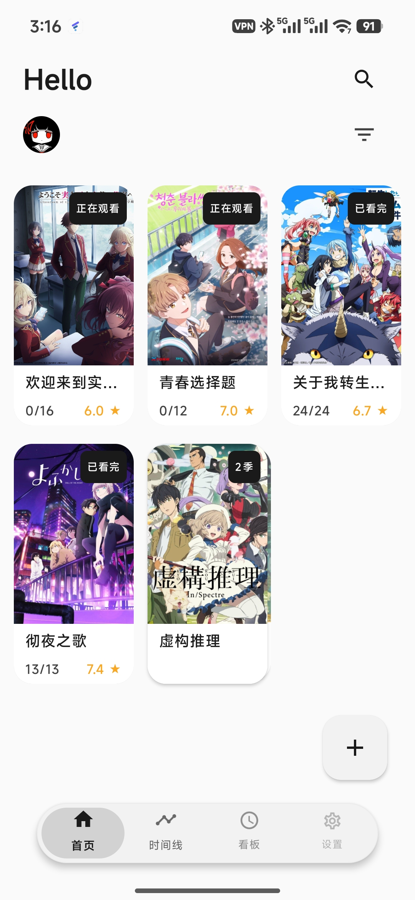
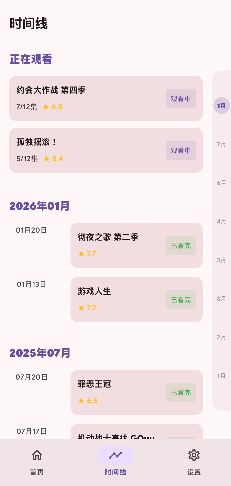
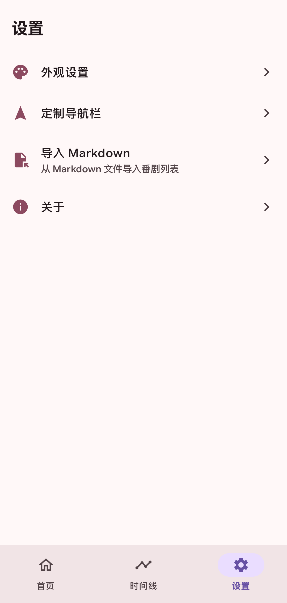
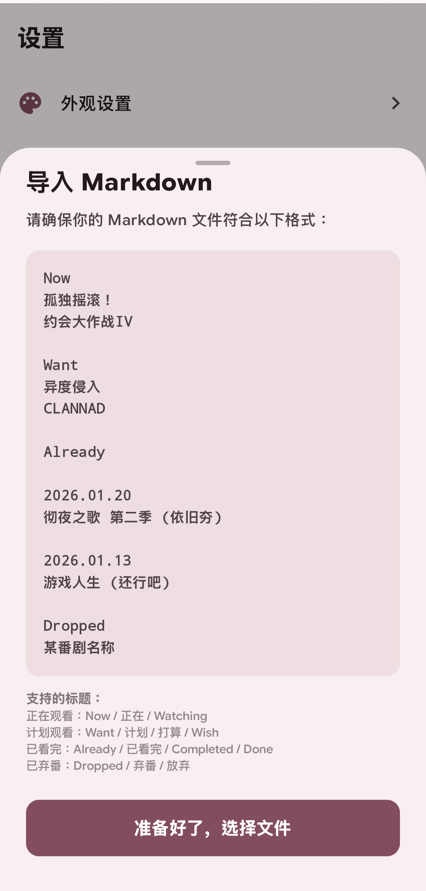
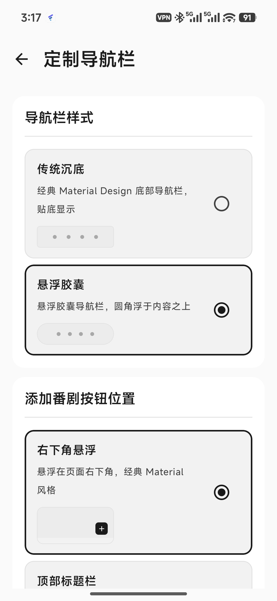
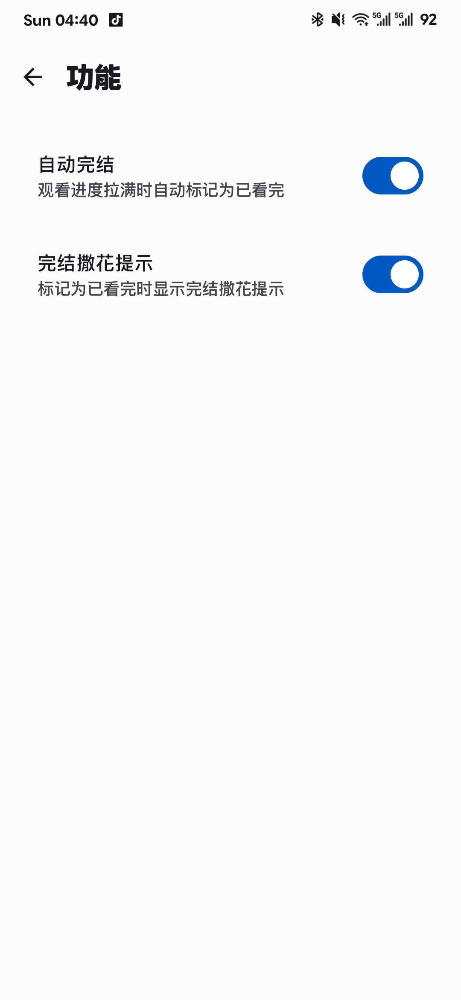
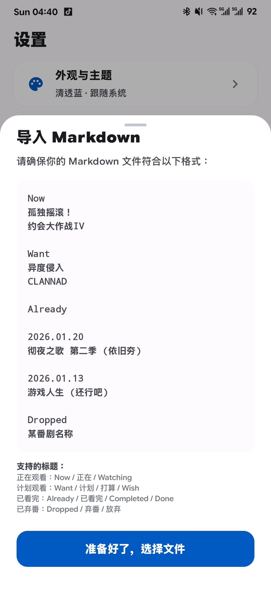

# 📺 AnimeTrack (AnimeTrack)

**AnimeTrack** 是一款基于 Jetpack Compose 构建的现代化番剧追踪应用。它专注于提供极致的交互体验，帮助二次元爱好者轻松记录和管理自己的追番进度。

*介绍界面哪天有时间了再精细一番吧*

---

## 核心特性

* **🎨 Bangumi自动搜索获取封面图**
* **🖐️ 支持MD文件导入**
* **📊 进度管理**：清晰的番剧卡片设计，支持快速标记“想看”、“在看”及“已看”状态。
* **📅 时间轴视图**：结构化的番剧更新追踪（正在完善中）。

## 应用截图

<table style="width: 75%; margin: 0 auto; text-align: center;">
  <!-- 第一行：4张图 -->
  <tr>
    <td width="40%"></td>
    <td width="40%"></td>
    <td width="40%"></td>
  </tr>
</table>

<!-- 第二行单独用一个居中的表格放 3 张图，保持宽度一致 -->
<table style="width: 100%; text-align: center;">
  <tr>
    <td width="30%"></td>
    <td width="30%"></td>
    <td width="30%"></td>
    <td width="30%"></td>
  </tr>
</table>

## 快速开始

### 环境要求
安卓机

### 安装步骤

